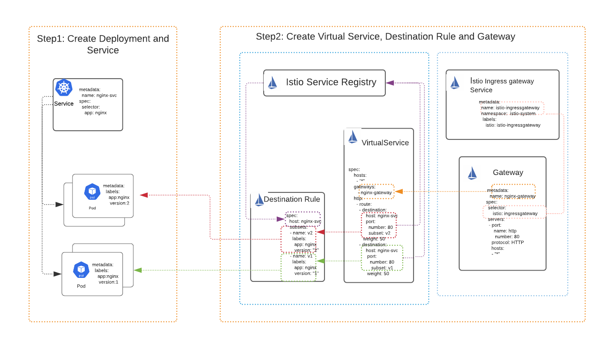
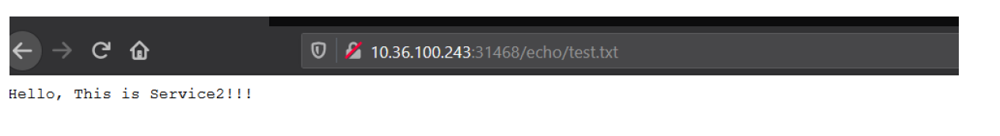
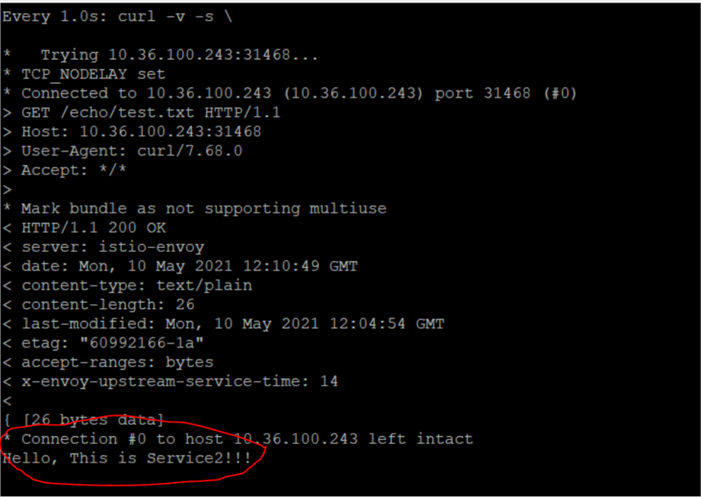
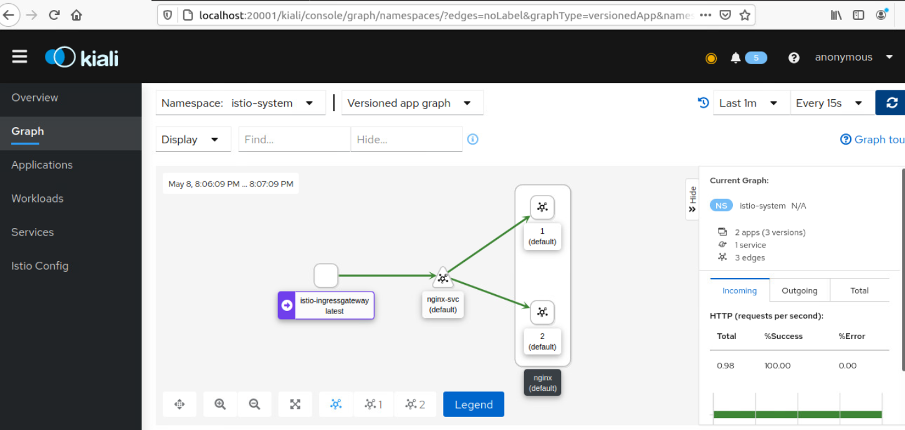

**##Introduction##**

The goal of this project is to demonstrate creation of a load balancer using Istio in kubernetes and explore destinationrule and dashboard features in Istio.

To achieve the above goal, I'll use the following topology:


**##### Environment Setup #####**
1. I chose kubernetes for this project to deploy NGINX Services, I deployed on single node ubuntu VM. The commands referred are specific to linux platform. yml config files  should work on any OS.
2.  I used minikube to run locally 
3.  I also used Istio for traffic management and load balancing. 

- Assuming basic kubernets is setup, please follow below instructions to install Istio.

**Installing Istio:**

Ref: https://istio.io/latest/docs/setup/getting-started/#download

For Linux Machine, I have commands listed as one go. 

```
curl -L https://istio.io/downloadIstio | sh -
cd istio-1.9.4
export PATH=$PWD/bin:$PATH
istioctl install --set profile=demo -y
kubectl label namespace default istio-injection=enabled
kubectl apply -f samples/addons
```

**######  Deploying the application ######**

**Step1: Create Deployment and Service**

- Deploy nginx application, by running the following command

`kubectl apply -f nginx-deployment.yml`

- Run below commands to verify the output, provided sample outputs in each section.

```
ubuntu@ubuntu2004:~/nginx-kubernetes-deployment$ kubectl get deployment
NAME       READY   UP-TO-DATE   AVAILABLE   AGE
nginx-v1   2/2     2            2           35s
nginx-v2   2/2     2            2           35s

```
```
ubuntu@ubuntu2004:~/nginx-kubernetes-deployment$ kubectl get pods
NAME                        READY   STATUS    RESTARTS   AGE
nginx-v1-85774d6bff-hs5w9   2/2     Running   0          24s
nginx-v1-85774d6bff-mfqmz   2/2     Running   0          24s
nginx-v2-7cf854fcd5-n9fbz   2/2     Running   0          24s
nginx-v2-7cf854fcd5-z9p84   2/2     Running   0          24s

```
```
ubuntu@ubuntu2004:~/nginx-kubernetes-deployment$ kubectl get services
NAME         TYPE        CLUSTER-IP    EXTERNAL-IP   PORT(S)   AGE
kubernetes   ClusterIP   10.96.0.1     <none>        443/TCP   7m32s
nginx-svc    ClusterIP   10.99.70.22   <none>        80/TCP    71s

```
**Step2: Create Virtual Service, Destination Rule and Gateway**

-  Run the following command

  `kubectl apply -f nginx-gateway.yml`

```
ubuntu@ubuntu2004:~/nginx-kubernetes-deployment$ kubectl apply -f nginx-gateway.yml
destinationrule.networking.istio.io/nginx created
gateway.networking.istio.io/nginx-gateway created
virtualservice.networking.istio.io/nginx created

```
> To make sure there are no errors, run below command
```
ubuntu@ubuntu2004:~/nginx-kubernetes-deployment$ istioctl analyze

✔ No validation issues found when analyzing namespace: default.

```
- you can run below commands to see gateway and virtualservice

```
  kubectl get gateway
  kubectl get virtualservices
```

**Step3 : Testing**

-  Run below commands to get the port number and ip information of istio-ingressgateway. 

```
  export INGRESS_PORT=$(kubectl -n istio-system get service istio-ingressgateway -o jsonpath='{.spec.ports[?(@.name=="http2")].nodePort}')
  export INGRESS_HOST=$(minikube ip)
  export GATEWAY_URL=$INGRESS_HOST:$INGRESS_PORT
  echo "http://$GATEWAY_URL/echo/test.txt"
```

-  Paste the output from the previous command into your web browser and you will see output.
  
-  You can curl and watch that application is load balanacing by using below command on the same node, notice the last line, it switches between Service1 and Service2.
    
```
  watch -n 1 'curl -v -s \
  http://$GATEWAY_URL/echo/test.txt'
```


  
**Step4: Access the  dashboard (Optional)**

-  I chose to use Kiali, verify it is deployed sucessfully by running below command. 

  ` kubectl rollout status deployment/kiali -n istio-system`

```
  ubuntu@ubuntu2004:~/nginx-kubernetes-deployment$ kubectl rollout status deployment/kiali -n istio-system
  deployment "kiali" successfully rolled out
  ubuntu@ubuntu2004:~/nginx-kubernetes-deployment$
```
- Run below command to view, it might ask you to install socat, please do based on your os.

 ` istioctl dashboard kiali`

- By going to http://localhost:20001/kiali, you can see the dashboard.




**####Clean up####**

_To Uninstall Istio_
- _Make sure you do not have any other applications using Istio_

```
  cd istio-1.9.4
  kubectl delete -f samples/addons
  istioctl manifest generate --set profile=demo | kubectl delete --ignore-not-found=true -f -
  kubectl delete namespace istio-system
  kubectl label namespace default istio-injection-
```
_To Uninstall application, run below command._

```
kubectl delete -f nginx-kubernetes-deployment/
```

### What's Next ###
- Add end to end encryption
- I would add resource requirements to application and setup Autoscaling.
- Implement sorry page probably using NGINX ingress
- Create custom health page instead of simple config that I used.

